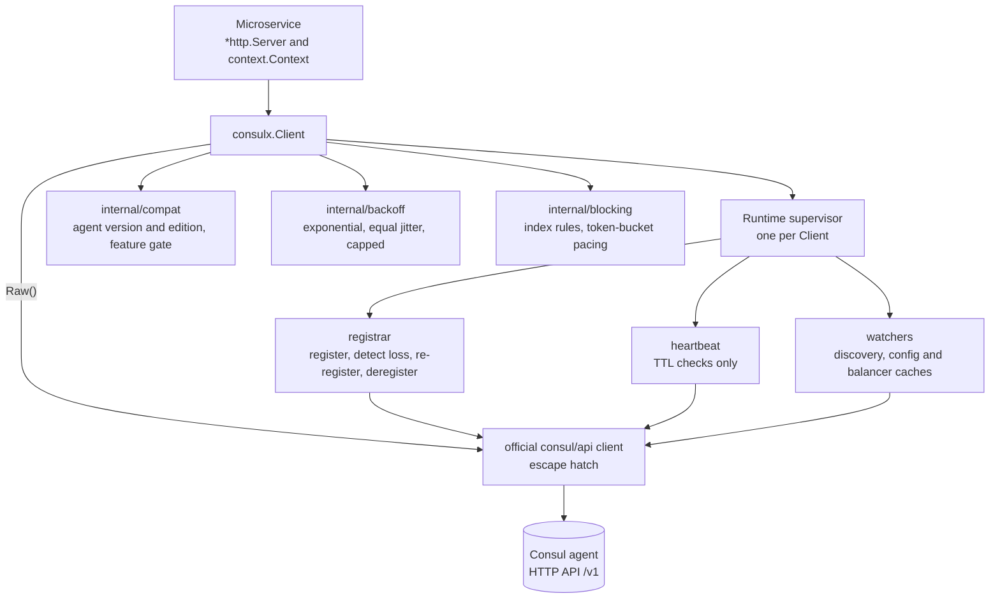
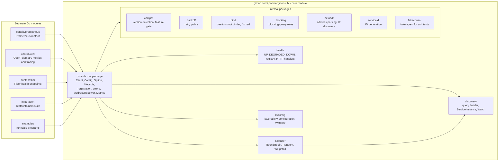
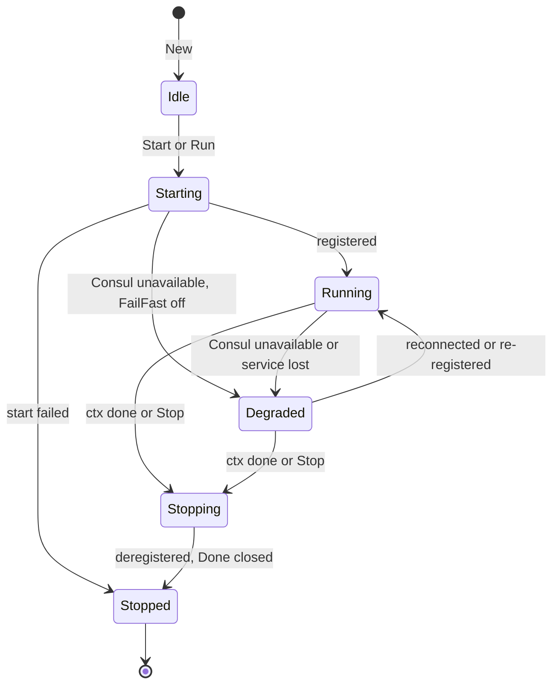

# ConsulX Architecture

Status: **implemented (v0.x)**. Evidence for every Consul-related claim is in
[compatibility.md](compatibility.md); decisions are recorded in
[decisions/](decisions/).

## 1. Scope

ConsulX is an application integration layer on top of the official client
`github.com/hashicorp/consul/api`. It owns what every Go microservice
re-implements by hand: resolving its own address, registering, health
endpoints, heartbeats, re-registration, deregistration, discovery, client-side
load balancing and layered configuration from KV. Everything else in Consul is
reachable through `Client.Raw()`.

Functional benchmark: Spring Cloud Consul (discovery + distributed config).
Programming model: plain Go (structs, functional options, `context.Context`,
channels, errors). No container, no annotations, no global state.



## 2. Module and package layout

The core module must not pull in web frameworks, Prometheus, OpenTelemetry or
Testcontainers. Anything with a heavy dependency lives in its own Go module.



A planned `kv/` package was dropped: the official KV client already accepts a
context through `QueryOptions.WithContext`, so a wrapper would add nothing.
KV is used through `Raw().KV()`.

Why not one package per Consul API (`acl/`, `catalog/`, `session/`...)?
Those would be thin copies of the official client with no added behaviour.
They are reachable with `Raw()` and listed as `Low-level supported`. A package
is added only when ConsulX contributes real behaviour (policy, lifecycle,
decoding, caching).

Why no Gin/Echo/Chi adapters by default? All three produce an `http.Handler`,
so the generic integration already covers health injection and registration
for them. They get examples and tests, not packages. An adapter is created
only where `net/http` is not enough: Fiber (fasthttp) is the only confirmed
case. Route metadata via adapters is deferred until a concrete use appears.

## 3. Public API

```go
// Construction never touches the network. It validates, normalises and
// wraps the server handler. It returns an error instead of panicking.
func New(opts ...Option) (*Client, error)

type Option interface{ apply(*settings) error }

// Config is itself an Option, so struct-based and option-based
// configuration compose: New(cfg, WithServer(srv)).
type Config struct {
    Consul    ConsulConfig    // address, scheme, datacenter, token, TLS, timeouts
    Service   ServiceConfig   // name, id, address, port, tags, meta, weights...
    Health    HealthConfig    // endpoints, check kind, interval, timeout, TTL...
    Retry     RetryConfig
    Lifecycle LifecycleConfig // AutoRegister, FailFast, StartTimeout, ShutdownTimeout
    KV        KVConfig        // distributed configuration layout and format
}

func LoadConfig(path string) (Config, error)   // YAML or JSON, then env overlay
func ConfigFromEnv() (Config, error)

type Client struct{ /* unexported */ }

func (c *Client) Start(ctx context.Context) error // register (per FailFast), launch runtime
func (c *Client) Stop(ctx context.Context) error  // stop workers, deregister, wait
func (c *Client) Run(ctx context.Context) error   // Start, block on ctx, Stop
func (c *Client) Done() <-chan struct{}           // closed after Stop completes
func (c *Client) Errors() <-chan error            // async runtime errors, non-blocking
func (c *Client) State() State                    // Idle, Starting, Running, Degraded, Stopping, Stopped

func (c *Client) Registration() Registration       // effective service ID, address, port
func (c *Client) Health() *health.Registry         // app reports UP/DEGRADED/DOWN
func (c *Client) Discovery() *discovery.Client
func (c *Client) HealthHandler() http.Handler      // manual mounting
func (c *Client) Discovery() *discovery.Client
func (c *Client) Balancer(s balancer.Strategy, opts ...balancer.Option) *balancer.Balancer
func (c *Client) Config() *kvconfig.Loader
func (c *Client) Register(ctx) error / Deregister(ctx) error     // explicit, no runtime
func (c *Client) EnableMaintenance(ctx, reason) / DisableMaintenance(ctx)
func (c *Client) AgentInfo(ctx) (AgentInfo, error)
func (c *Client) EffectiveConfig() Config
func (c *Client) Raw() *api.Client
```

Differences from the conceptual API in the brief, with reasons:

| Brief                               | ConsulX                                  | Reason                                                                                                                                                                                                                        |
| ----------------------------------- | ---------------------------------------- | ----------------------------------------------------------------------------------------------------------------------------------------------------------------------------------------------------------------------------- |
| `consul := consulx.New(...)`        | `consul, err := consulx.New(...)`        | Invalid configuration must be reported, not panic.                                                                                                                                                                            |
| `consul.Config().Watch(ctx, &cfg)`  | `kvconfig.Watch[T](ctx, loader, ...)`    | Writing into a caller-owned struct from a watcher goroutine is a data race. The watcher publishes immutable `T` values instead; `Current()` returns the last accepted one. Methods cannot be generic in Go, hence a function. |
| `consul.LoadBalancer(RoundRobin())` | `consul.Balancer(balancer.RoundRobin())` | Same shape; the `balancer` package keeps the root small.                                                                                                                                                                      |

Everything else keeps the brief's shape, including
`consul.Discovery().Service("payments").Passing().Datacenter("dc1").All(ctx)`
and `First(ctx)`.

## 4. HTTP integration

- Input is `*http.Server`. ConsulX never creates, starts or stops it.
- In `New`, if health endpoints are enabled, `server.Handler` is replaced by a
  small wrapper that serves the configured exact paths and delegates every
  other request to the original handler (or `http.DefaultServeMux` when nil).
  This happens in `New` because `net/http` reads `Server.Handler` on every
  request: changing it after `ListenAndServe` starts is a data race.
  Documented requirement: call `New` before the server starts serving.
- Health status mapping uses Consul's HTTP check semantics:
  `UP → 200` (passing), `DEGRADED → 429` (warning), `DOWN → 503` (critical).
  Response body is small JSON with component details; details can be hidden.
- Endpoints are opt-in and configurable: `/health` (aggregate),
  `/health/live` (process alive, never depends on dependencies),
  `/health/ready` (dependencies ready; this is what Consul checks by default).
- Port is taken from `server.Addr`. Host is only trusted when it is a concrete
  routable IP. When the port is `0`, `WithListener(net.Listener)` supplies the
  real one.

### 4.1 Address resolution

`AddressResolver` is an interface; the default is a chain, first success wins:

1. Explicit `Service.Address` / `WithServiceAddress` (also fed by the
   `CONSULX_SERVICE_ADDRESS` environment layer).
2. The environment variable named by `Service.AddressEnv`, e.g. `POD_IP`
   populated from `status.podIP` by the Kubernetes Downward API.
3. Host from `server.Addr` when it is a concrete, non-wildcard IP.
4. Route to Consul: the local IP the kernel would use to reach the Consul
   address (UDP "connect", no packets sent). Works in Docker, Compose, pods
   and VMs because it follows the actual route.
5. First private, up, non-loopback interface address (skipping known virtual
   bridges). IPv4 preferred unless configured otherwise.

Wildcards (`0.0.0.0`, `::`) are always rejected. Loopback is rejected unless
`AllowLoopback` is set (useful when app and agent share one host and all
consumers are local).

## 5. Registration

- Agent API only (`/v1/agent/service/register` with
  `replace-existing-checks=true`), never Catalog registration, because the
  agent performs anti-entropy.
- Default service ID: `<name>-<hostname>-<port>`, lower-cased and sanitised.
  Rationale: unique per instance (a host cannot bind the same port twice;
  containers and pods get unique hostnames), and stable across restarts, so a
  restarted process replaces its own entry instead of leaving an orphan.
  `IDStrategy` can switch to `<name>-<uuid>`; `WithServiceID` wins over both.
- Automatic metadata (opt-out, never overwrites a key the user set explicitly,
  documented rule: user keys win): `consulx_version`, `hostname`,
  `go_version`, `language=go`, plus `version`, `environment`, `zone` when
  configured. Scheme is published as `secure=true|false` (Spring-compatible).
- Before sending, the definition is checked against the feature gate
  (e.g. `Ports` requires ≥ 1.22, Namespace/Partition require Enterprise).
- Default check: HTTP against the readiness endpoint, interval 10s (Spring
  Cloud Consul default), timeout 5s (must be below interval; Consul's own
  default of 10s would equal it), `DeregisterCriticalServiceAfter` 1m (the
  Consul minimum; the reaper runs periodically so removal happens within
  roughly 1m-1m30s). False positives are self-healing because the runtime
  re-registers a missing service.

## 6. Runtime and lifecycle



- One supervisor goroutine per `Client`, children started with
  `errgroup.WithContext`. Each goroutine is documented with its purpose and
  exit condition, and every one exits when the runtime context is cancelled.
- **Loss detection without aggressive polling:** the registrar performs a
  blocking query on `GET /v1/agent/service/:id` (hash-based blocking). A `404`
  means the agent lost the service (agent restart, reaper) → re-register.
  Transport errors → `Degraded`, exponential backoff, re-register on recovery.
- **TTL mode:** heartbeat every TTL/3 reporting the `health.Registry` status
  (pass/warn/fail). A "check not found" response triggers re-registration.
- **FailFast=true:** `Start` retries within `StartTimeout` (default 30s) and
  returns `ErrConsulUnavailable` / `ErrRegistrationFailed` if it cannot
  register. **FailFast=false (default):** `Start` returns once the runtime is
  launched; registration continues in the background. Default chosen for
  availability: a Consul outage should not stop an already healthy service
  from starting. Config loading is not affected; its errors are always
  returned to the caller.
- **Shutdown:** stop watchers and heartbeat, then deregister with a context
  derived from `context.WithoutCancel(parent)` bounded by `ShutdownTimeout`
  (default 10s). This is the one documented use of a detached context:
  deregistration must run _after_ the caller's context was cancelled.
  `DeregisterCriticalServiceAfter` covers SIGKILL, OOM and host loss.
- Signals are never captured. The application passes a context from
  `signal.NotifyContext`.
- `Errors()` is buffered; sends never block. When full, the error is dropped
  and counted (`consulx_errors_dropped_total`). Everything is also logged.
- A `Client` is single-use: `Start` twice → `ErrAlreadyStarted`, after `Stop`
  → `ErrAlreadyStopped`. `Stop` is idempotent-safe to call concurrently.

## 7. Retry

`RetryConfig{InitialDelay: 500ms, MaxDelay: 30s, Multiplier: 2, jitter on,
MaxAttempts: 0 (unlimited), MaxElapsed: 0 (unlimited)}`. Each attempt is
bounded by `Consul.RequestTimeout`. Jitter is "equal jitter": a delay `d`
becomes a uniform value in `[d/2, d]`. It spreads reconnects of many
instances that lost the same agent, like full jitter, but never produces
near-zero waits that would turn an outage into a hot loop. Every wait selects
on the context. `RetryPolicy` is an interface so users can plug their own.

## 8. Discovery and load balancing

- Built on `Health().ServiceMultipleTags` (health-aware), never on Catalog for
  instance selection.
- **Default filter is `passing` only.** Returning critical instances by default
  is the unsafe choice for callers; `.AnyStatus()` opts out. `.Passing()` is
  kept as an explicit no-op for readability.
- `ServiceInstance` keeps: ID, Name, Address (service address, falling back to
  node address), Port, Ports, Scheme (from `secure` meta), Tags, Meta,
  TaggedAddresses, Weights, Datacenter, Namespace, Partition, Node (ID, name,
  address, meta), aggregated Status and the raw checks.
- Watches use blocking queries with `WaitIndex`/`WaitTime` (default 5m),
  following Consul's index rules: reset to 0 when the index goes backwards,
  never wait on index 0, enforce a minimum interval between calls, back off on
  errors. Events carry the full snapshot plus added/removed/changed sets.
  Delivery coalesces: a slow consumer receives the latest snapshot, never a
  backlog, and the watcher never blocks on a full channel.
- `Balancer` is backed by one shared watch per service (lazily started, tied
  to the Client lifecycle), so `Next` is a memory read, not a Consul request.
  Strategies: RoundRobin, Random, Weighted (Consul `Weights.Passing` /
  `Weights.Warning`). `Strategy` is an interface.

## 9. Distributed configuration (KV)

- Layout is Spring-compatible by default, lowest to highest precedence:
  `config/application/`, `config/application,<profile>/`,
  `config/<service>/`, `config/<service>,<profile>/`. Prefix, default context
  and separator are configurable.
- Formats: `KeyValue` (default, key path segments map to fields), `YAML` and
  `JSON` (single `data` key per context).
- Binding (`internal/bind`): string, bool, ints, uints, floats,
  `time.Duration`, `encoding.TextUnmarshaler`, slices, maps, nested structs,
  pointers. Tags: `consul:"name"`, `consul:"name,required"`,
  `default:"..."`. Unknown keys are ignored; type errors report the full key
  path. No `unsafe`, no unexported field writes.
- Validation: if the type implements `Validate() error` it is called; an
  extra validator function can be supplied.
- Dynamic config: `kvconfig.Watch[T]` watches every layer with blocking
  queries, rebuilds a fresh `T`, validates, and only then publishes it.
  Invalid changes are rejected, logged ("configuration rejected"), counted,
  and the previous value remains current. A reload that cannot read Consul
  is logged as "configuration reload failed" instead: nothing was evaluated,
  so nothing was rejected. Every layer wakes on a write, but a rejected
  state is rebuilt and reported once, not once per layer.

## 10. Configuration precedence

Lowest to highest; later layers override only fields they set:

1. Built-in defaults (documented in `defaults.go`, each with a reason).
2. File via `LoadConfig` (YAML/JSON).
3. Environment: the official `CONSUL_*` variables (handled by the official
   client) plus `CONSULX_*` for service-level fields.
4. `Config` struct passed to `New`.
5. Functional options, applied in argument order.

A `Config` passed to `New` is a full layer, but zero values do not override
earlier layers (Go cannot distinguish "unset" from "zero"). Where zero is a
meaningful value, the field is a pointer or the option must be used; this is
documented per field.

## 11. Observability

- Logging: `*slog.Logger` via `WithLogger`; default `slog.Default()`. Event
  names follow the brief. Tokens, TLS keys and KV values are never logged;
  the ACL token type has a redacting `String`/`LogValue`.
- Metrics: small `Metrics` interface in the core, no-op by default. The
  `contrib/prometheus` and `contrib/otel` modules implement it.
- Tracing: `WithHTTPClient`/`WithTransport` lets users install `otelhttp`;
  the `contrib/otel` module provides a helper.

## 12. Errors

Sentinels: `ErrInvalidConfiguration`, `ErrAlreadyStarted`,
`ErrAlreadyStopped`, `ErrNotRegistered`, `ErrConsulUnavailable`,
`ErrRegistrationFailed`, `ErrDeregistrationFailed`, `ErrUnsupportedFeature`,
`ErrServiceNotFound`. Typed errors: `*ConfigError{Field, Reason}`,
`*UnsupportedFeatureError{Feature, Required, Actual}`, `*BindError{Key,
Type, Err}`. All wrap causes with `%w`, compatible with `errors.Is/As`.

## 13. Testing strategy

| Layer          | Tooling                                                                                   | Covers                                                                                                                                                                                   |
| -------------- | ----------------------------------------------------------------------------------------- | ---------------------------------------------------------------------------------------------------------------------------------------------------------------------------------------- |
| Unit           | `internal/fakeconsul` (httptest fake agent)                                               | options, config, IDs, resolver, handler wrapping, registration payloads, retry, discovery decoding, binding, lifecycle state machine                                                     |
| Race           | `go test -race ./...` on every change                                                     | all                                                                                                                                                                                      |
| Leaks          | `go.uber.org/goleak` in `TestMain` of each package with goroutines                        | start, stop, cancel, retry, watch cancellation                                                                                                                                           |
| Integration    | separate module, Testcontainers-Go, real Consul                                           | registration visible + passing, deregistration, DeregisterCriticalServiceAfter reaping, FailFast both modes, Consul down/up reconnect with re-registration, watches, KV config, TLS, ACL |
| Version matrix | `CONSUL_VERSION=1.21 go test ./...` in `integration/`, CI matrix 1.20 / 1.21 / 1.22 / 2.0 | compat gate                                                                                                                                                                              |
| Fuzz           | `go test -fuzz`                                                                           | bind, address parsing, service ID sanitising, config parsing, health path matching                                                                                                       |
| Benchmarks     | `testing.B`                                                                               | binding, balancer `Next` (single, stale grace, 32 concurrent callers), discovery conversion and selection, full health query, readiness probe, handler wrapper                           |
| Examples       | runnable `examples/` module, smoke-tested against Docker Consul                           | net/http, Gin, Echo, Chi, discovery, config, watch, TLS, ACL                                                                                                                             |

## 14. Implementation status

All ten phases are implemented. Each phase ended with `go vet`, `go test`,
`go test -race` (run in a Linux container) and, from registration on, the
integration suite against real agents. See [status.md](status.md) for the
Definition of Done checklist, known limitations and remaining work.

## 15. Known risks

- Health endpoint injection requires `New` before `ListenAndServe`; misuse is
  not detectable (documented; `HealthHandler()` allows manual mounting).
- Address auto-detection cannot be right in every network topology; the
  resolver chain is explicit and logged, and explicit configuration wins.
- The official client adds fields ahead of agent support (`AI`). The feature
  gate must be kept up to date with each client upgrade;
  `TestRegistrationFieldsAreClassified` fails when the client gains a
  registration field that is neither gated nor classified as safe.
- Enterprise-only paths (namespaces, partitions) cannot be integration tested
  without an Enterprise license; they are labelled accordingly.
