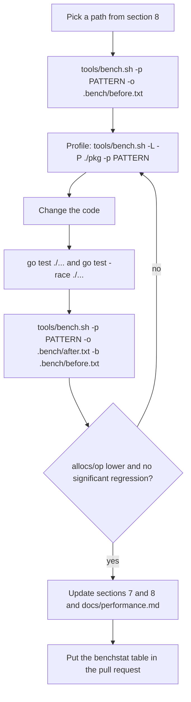

# Benchmarks

ConsulX runs inside other people's services, so every byte and CPU cycle it
uses is taken from them. This suite measures what each feature costs and
how much a running client keeps from its host service. The goal is **zero
allocations on the paths that run per request**, and as few as possible on
the others.

## Table of contents

1. [Rules](#1-rules)
2. [Running the benchmarks](#2-running-the-benchmarks)
3. [Reading the results](#3-reading-the-results)
4. [Profiling CPU and memory](#4-profiling-cpu-and-memory)
5. [What is measured](#5-what-is-measured)
6. [Impact on a service](#6-impact-on-a-service)
7. [Results](#7-results)
8. [Towards zero allocations](#8-towards-zero-allocations)
9. [Optimisation workflow](#9-optimisation-workflow)

## 1. Rules

- **Benchmarks are local only.** Every benchmark file starts with
  `//go:build bench`, so `go build`, `go vet`, `go test` and golangci-lint
  never see them unless the tag is passed, and no GitHub Actions workflow
  passes it. Shared CI runners are too noisy for timing results, and
  benchmarks would slow every pull request down for no reliable signal.
- Benchmark files are named `bench_test.go` and live next to the code they
  measure, so they can reach unexported functions.
- Every benchmark calls `b.ReportAllocs()`: allocations are the metric the
  project optimises first, because they are exact and machine independent.
- Benchmarks that talk to Consul use the in-process fake agent
  (`internal/fakeconsul`) and never need a real agent or Docker.
- Each benchmark that sends a request to Consul has a `raw-api` variant
  sending the same request with the official client. The difference
  between the two is what ConsulX adds on top of `consul/api`.
- Benchmarks must not import modules the `go.mod` does not already need:
  `go mod tidy` considers every build tag, and CI checks that `go.mod` is
  tidy.

## 2. Running the benchmarks

`tools/bench.sh` runs the core module and the contrib modules, writes the
results to `.bench/` (ignored by Git) and compares them with
[benchstat](https://pkg.go.dev/golang.org/x/perf/cmd/benchstat), using an
installed `benchstat` or fetching it with `go run`.

```sh
tools/bench.sh                          # everything, 6 runs of 1s each
tools/bench.sh -c 1 -t 200ms            # quick smoke run
tools/bench.sh -p 'Next|Pick'           # only benchmarks matching a regexp
tools/bench.sh -m contrib/otel          # one module
tools/bench.sh -o .bench/before.txt     # save a baseline
tools/bench.sh -o .bench/after.txt -b .bench/before.txt   # compare
tools/bench.sh -L                       # inside a Linux container (Docker)
tools/bench.sh -h                       # all options
```

Without the script, pass the tag yourself:

```sh
go test -tags bench -run '^$' -bench . -benchmem ./...
go test -tags bench -run '^$' -bench 'BenchmarkNextStrategy' -benchmem -count 6 ./balancer
cd contrib/prometheus && go test -tags bench -run '^$' -bench . -benchmem .
```

`-run '^$'` skips the unit tests, so only benchmarks run.

## 3. Reading the results

| Column       | Meaning                                                                                                                                                    |
| ------------ | ---------------------------------------------------------------------------------------------------------------------------------------------------------- |
| `ns/op`      | wall time per operation. Moves ±10% with machine load: compare only runs taken back to back on the same machine                                            |
| `B/op`       | bytes allocated per operation. Exact                                                                                                                       |
| `allocs/op`  | heap allocations per operation. Exact, and the first thing to drive towards zero: every allocation is future garbage collector work taken from the service |
| `heap-B`     | (`BenchmarkRuntimeFootprint`) live heap a running client keeps after a garbage collection                                                                  |
| `goroutines` | (`BenchmarkRuntimeFootprint`) goroutines a running client keeps, including two per open HTTP connection                                                    |

Things to keep in mind:

- `B/op` and `allocs/op` count every allocation in the process during the
  benchmark. For benchmarks against the fake agent that includes its HTTP
  server, which is why those benchmarks have a `raw-api` baseline: compare
  `consulx-*` with `raw-api-*`, not with zero.
- `-parallel` variants use `b.RunParallel` with one goroutine per CPU;
  their `ns/op` is wall time divided by operations across all CPUs, so it
  shows how a path scales (compare with the sequential variant), not how
  long one call takes.
- A single run is an anecdote. Use at least six runs (`-c 6`, the default)
  and benchstat, which reports the spread and whether a difference is
  significant (`~` means it is not).

## 4. Profiling CPU and memory

```sh
tools/bench.sh -P ./balancer -p NextStrategy       # profile one package
tools/bench.sh -L -P ./discovery -p WatchUpdate    # same, in Linux
```

The script writes `.bench/profiles/<package>.cpu` and `.mem`, prints the
top CPU consumers and allocation sites, and shows the commands for the
interactive views:

```sh
go tool pprof -http=: .bench/profiles/balancer.cpu
go tool pprof -http=: -sample_index=alloc_space .bench/profiles/balancer.mem
```

`-sample_index=alloc_space` ranks by bytes allocated and
`-sample_index=alloc_objects` by number of allocations; the latter is the
one to follow towards zero allocations. To see why a value escapes to the
heap, ask the compiler:

```sh
go build -gcflags='-m' ./balancer 2>&1 | grep -E 'escapes|moved to heap'
```

On Windows `-cpuprofile` can freeze the test binary; use `-L` to profile in
a Linux container instead.

## 5. What is measured

The suite covers every feature and the processes behind them. The
"Frequency" column says how often the path runs in a service, which is what
turns a cost into an impact.

### Core package (`bench_test.go`)

| Benchmark                                                        | Measures                                                                                                                                              | Frequency                                              |
| ---------------------------------------------------------------- | ----------------------------------------------------------------------------------------------------------------------------------------------------- | ------------------------------------------------------ |
| `BenchmarkMiddlewareOverhead`                                    | cost of the injected health router on every application request, against the bare handler (`direct`), sequential and parallel                         | every inbound request                                  |
| `BenchmarkHealthEndpoints`                                       | `/health`, `/health/live`, `/health/ready` and `HEAD`, with two checkers and one pushed component                                                     | every health poll (Consul, Kubernetes, load balancers) |
| `BenchmarkRuntimeAccessors`                                      | `State` and `Registration`, sequential and parallel                                                                                                   | whenever the application reads them                    |
| `BenchmarkMetricsNoop`                                           | metric calls with no metrics backend configured                                                                                                       | every registration, heartbeat and query                |
| `BenchmarkHeartbeat`                                             | one TTL update: readiness probe plus request (`raw-api` baseline)                                                                                     | every TTL/3 (10s by default)                           |
| `BenchmarkRegister`                                              | agent detection, endpoint resolution, definition and request (`raw-api` baseline)                                                                     | start-up and every re-registration                     |
| `BenchmarkBuildRegistration`                                     | the service definition, HTTP and TTL checks                                                                                                           | every registration                                     |
| `BenchmarkResolveEndpoint`                                       | configured address, custom resolver and the default route lookup                                                                                      | every registration                                     |
| `BenchmarkLifecycle`                                             | a complete `Start` and `Stop`                                                                                                                         | once per process                                       |
| `BenchmarkRuntimeFootprint`                                      | live heap and goroutines of a running client: registered with an HTTP check, with a TTL check, and a full client (TTL, balancer, configuration watch) | permanent                                              |
| `BenchmarkNew`, `BenchmarkParseConfig`, `BenchmarkConfigFromEnv` | building a client and reading its configuration                                                                                                       | once per process                                       |
| `BenchmarkSecret`                                                | the redacted token type as logging formats it                                                                                                         | when logged                                            |

### `health`

| Benchmark                | Measures                                                                                      | Frequency                       |
| ------------------------ | --------------------------------------------------------------------------------------------- | ------------------------------- |
| `BenchmarkProbe`         | readiness evaluation with 0 to 10 checkers and pushed components                              | every health poll               |
| `BenchmarkProbeParallel` | concurrent probes sharing checker executions                                                  | concurrent polls                |
| `BenchmarkSet`           | pushing a component state: plain, with details, with a listener (the TTL heartbeat), parallel | whenever the application pushes |
| `BenchmarkHandler`       | probe plus JSON response, with and without details, `HEAD`                                    | every health poll               |
| `BenchmarkStatus`        | status aggregation and HTTP code mapping                                                      | every probe                     |

### `discovery`

| Benchmark                                                              | Measures                                                                                                                                   | Frequency                         |
| ---------------------------------------------------------------------- | ------------------------------------------------------------------------------------------------------------------------------------------ | --------------------------------- |
| `BenchmarkQuery`                                                       | a complete `Query.All` for 3, 20 and 100 instances (`raw-api` baseline)                                                                    | every one-shot query              |
| `BenchmarkWatchUpdate`                                                 | propagation of one change through a watch: wake-up, decoding, conversion, comparison, event (`raw-api` baseline: the blocking query alone) | every change of a watched service |
| `BenchmarkWatchRead`                                                   | `Pick` (copies the selected instance), `PickEndpoint` (zero allocations) and `Instances` (full copy), sequential and parallel              | per selection / per read          |
| `BenchmarkConvert`, `BenchmarkSort`, `BenchmarkDiff`, `BenchmarkClone` | the steps of every response and every event                                                                                                | per response / per change         |
| `BenchmarkQueryBuild`                                                  | request options for plain, tag, metadata and filter queries                                                                                | every request                     |
| `BenchmarkInstanceHelpers`                                             | `HostPort`, `URL`, `PortNamed`, `Weight`                                                                                                   | per outbound call, when used      |

### `balancer`

| Benchmark                   | Measures                                                                        | Frequency                                       |
| --------------------------- | ------------------------------------------------------------------------------- | ----------------------------------------------- |
| `BenchmarkNextStrategy`     | `Next` end to end for each strategy and 3, 20 and 100 instances                 | **every outbound call**                         |
| `BenchmarkNextEndpoint`     | `NextEndpoint` for each strategy and size, in parallel and with a custom picker | **every outbound call**                         |
| `BenchmarkNextContention`   | `Next` from every CPU at once, per strategy and across services                 | every outbound call under load                  |
| `BenchmarkNextOptions`      | the cost of stale grace and idle release on `Next`                              | every outbound call                             |
| `BenchmarkNextManyServices` | `Next` when the balancer tracks 1, 10 or 50 services                            | every outbound call of gateways and aggregators |
| `BenchmarkPicker`           | each strategy alone, without the watch                                          | inside every `Next`                             |
| `BenchmarkFirstUse`         | first `Next` of a service: watch start and initial response                     | once per service (and after idle release)       |

### `kvconfig`

| Benchmark                             | Measures                                                                                         | Frequency                         |
| ------------------------------------- | ------------------------------------------------------------------------------------------------ | --------------------------------- |
| `BenchmarkWatcherCurrent`             | reading the watched configuration, sequential and parallel                                       | whenever the application reads it |
| `BenchmarkWatchReload`                | propagation of one KV change: every folder watch wakes, reload, binding, validation, publication | every configuration change        |
| `BenchmarkLoad`                       | reading and merging every folder (`raw-api` baseline)                                            | start-up and every reload         |
| `BenchmarkLoadInto`                   | typed load of the whole tree or a subtree                                                        | start-up                          |
| `BenchmarkDecode`                     | key/value folders (7 and 107 keys), YAML and JSON documents                                      | every folder on every reload      |
| `BenchmarkMerge`, `BenchmarkBindTree` | layering folders and binding a loaded tree                                                       | every reload                      |

### Internal packages and contrib modules

| Package                              | Benchmarks                                                                                                                 | Frequency                           |
| ------------------------------------ | -------------------------------------------------------------------------------------------------------------------------- | ----------------------------------- |
| `internal/bind`                      | `BenchmarkBindShapes` (flat, typed values, fuzzy keys, nested, collections, strict), `BenchmarkLookup`, `BenchmarkSameKey` | every reload                        |
| `internal/blocking`                  | `BenchmarkLimiterWait`, `BenchmarkIndex`                                                                                   | every blocking request              |
| `internal/backoff`                   | `BenchmarkNextDelay`, `BenchmarkRetry`                                                                                     | every retry / registration          |
| `internal/compat`                    | `BenchmarkParse`, `BenchmarkSupports`                                                                                      | every (re)connection / registration |
| `internal/netaddr`                   | `BenchmarkParseListenAddress`, `BenchmarkClassify`, `BenchmarkSelect`, `BenchmarkRouteIP`                                  | every registration                  |
| `internal/serviceid`                 | `BenchmarkSanitize`, `BenchmarkGenerate`                                                                                   | once per process                    |
| `contrib/prometheus`, `contrib/otel` | `BenchmarkMetrics`: every call of the `Metrics` interface, with and without labels, and in parallel                        | every measurement ConsulX emits     |
| `contrib/fiber`                      | `BenchmarkMount`: an application route with and without the mounted endpoints, and the readiness endpoint                  | every request of a Fiber app        |

The benchmarks already present in the regular test files
(`BenchmarkNext`, `BenchmarkWatchPick`, `BenchmarkReadyProbe`, ...) keep
running with the suite; they are cheap and have no build tag, but no
workflow runs benchmarks either way.

## 6. Impact on a service

What a service pays for ConsulX is the cost of each path multiplied by how
often it runs. Figures from the [results](#7-results):

| Activity                                             | Rate in a typical service               | Cost per occurrence                                                         | Impact                                                                                              |
| ---------------------------------------------------- | --------------------------------------- | --------------------------------------------------------------------------- | --------------------------------------------------------------------------------------------------- |
| Inbound request through the injected health router   | every request                           | +9 ns, **0 allocations**                                                    | negligible                                                                                          |
| `Balancer.NextEndpoint`                              | every outbound call                     | 96 ns, **0 allocations**                                                    | none on the garbage collector                                                                       |
| `Balancer.Next` (full instance copy)                 | every outbound call that needs metadata | 0.4 µs, 464 B, 4 allocations (20 instances with tags, metadata and a check) | 1,000 calls/s produce about 460 KB/s of garbage; use `NextEndpoint` when only the address is needed |
| Readiness probe by Consul or Kubernetes              | every 10 s per poller                   | 10.5 µs, 2.3 KB, 28 allocations                                             | under 1 KB/s                                                                                        |
| TTL heartbeat                                        | every 10 s (TTL/3)                      | 1 KB and 9 allocations more than the bare request                           | negligible                                                                                          |
| Metric calls (no backend, Prometheus, OpenTelemetry) | every registration, heartbeat and query | **0 allocations**                                                           | none                                                                                                |
| Watched service changes                              | per change                              | +56 KB and +264 allocations over the bare blocking query (20 instances)     | depends on churn; idle services cost nothing                                                        |
| Configuration change                                 | per change                              | 64 KB, 674 allocations (two folders, including HTTP)                        | rare                                                                                                |
| Blocking queries while nothing changes               | every 5 min per watch                   | one request                                                                 | no CPU in between                                                                                   |

The steady-state footprint of a running client, from
`BenchmarkRuntimeFootprint` (upper bounds: the heap includes the fake
agent's side of the connections):

| Client                                                                    | Live heap | Goroutines                                      |
| ------------------------------------------------------------------------- | --------- | ----------------------------------------------- |
| registered, HTTP check                                                    | 105 KB    | 3 (registrar, plus two for its HTTP connection) |
| registered, TTL check                                                     | 105 KB    | 4 (adds the heartbeat)                          |
| full: TTL check, one balanced service, configuration watch on two folders | 174 KB    | 11                                              |

Each additional watched service or configuration folder adds one
goroutine for the watch and two for its HTTP connection. Blocking queries
wait on the agent, so an idle client uses no CPU apart from the heartbeat:
one TTL update every 10 s at about 0.5 ms of wall time (mostly loopback
HTTP), which is below 0.01% of one core.

## 7. Results

v0.2.0 against this release, measured back to back on 2026-09-25 with
Go 1.27.1, Windows 11, AMD Ryzen 9 5950X (32 threads),
`tools/bench.sh -c 6 -t 500ms`, medians of six runs. Allocation columns are
exact. Times of a 30-minute run drift with the machine's temperature, so
paths whose time looked worse were measured again interleaving both
versions (ten samples each): every one of them was faster, by 3% to 16%.

### Per request

| Benchmark                                     | v0.2.0                    | This release              |
| --------------------------------------------- | ------------------------- | ------------------------- |
| `NextEndpoint` (new), 20 instances            | not available             | **96 ns, 0 B, 0 allocs**  |
| `NextEndpoint` (new), weighted, 100 instances | not available             | **243 ns, 0 B, 0 allocs** |
| `NextEndpoint` (new), 32 goroutines           | not available             | **145 ns, 0 B, 0 allocs** |
| `Next`, round robin, 20 instances             | 355 ns, 464 B, 4 allocs   | 337 ns, 464 B, 4 allocs   |
| `Next`, weighted, 100 instances               | 2,902 ns, 464 B, 4 allocs | 717 ns, 464 B, 4 allocs   |
| `Next`, weighted, 20 instances                | 923 ns, 464 B, 4 allocs   | 591 ns, 464 B, 4 allocs   |
| `Next`, 32 goroutines, weighted               | 380 ns, 464 B, 4 allocs   | 268 ns, 464 B, 4 allocs   |
| `Next`, 32 goroutines, 10 services            | 307 ns, 478 B, 4 allocs   | 196 ns, 478 B, 4 allocs   |
| Weighted picker alone, 100 instances          | 1,725 ns                  | 166 ns                    |
| `Watch.Current().PickEndpoint` (new)          | not available             | **7.7 ns, 0 B, 0 allocs** |
| `State`, 32 goroutines                        | 28.5 ns                   | 0.03 ns                   |
| `State`                                       | 7.7 ns                    | 0.44 ns                   |
| Health router, pass-through                   | 13.4 ns, 0 allocs         | 12.2 ns, 0 allocs         |
| `Watcher.Current` (configuration)             | 2.2 ns, 0 allocs          | 2.2 ns, 0 allocs          |

### Health

| Benchmark                      | v0.2.0                       | This release                |
| ------------------------------ | ---------------------------- | --------------------------- |
| `/health/ready` endpoint       | 11.4 µs, 2,675 B, 33 allocs  | 10.5 µs, 2,288 B, 28 allocs |
| `/health/ready`, `HEAD`        | 7.4 µs, 2,272 B, 25 allocs   | 6.6 µs, 1,888 B, 20 allocs  |
| Probe, 10 pushed components    | 1,439 ns, 3,720 B, 11 allocs | 789 ns, 1,880 B, 5 allocs   |
| Probe, 3 checkers and 3 pushed | 7.8 µs, 3,467 B, 33 allocs   | 6.4 µs, 2,663 B, 28 allocs  |
| Probe, 10 checkers             | 17.6 µs, 9,105 B, 93 allocs  | 14.0 µs, 7,229 B, 87 allocs |
| Concurrent probes, 3 pushed    | 368 ns, 1,104 B, 6 allocs    | 290 ns, 752 B, 3 allocs     |

### Discovery

| Benchmark                              | v0.2.0                          | This release                 |
| -------------------------------------- | ------------------------------- | ---------------------------- |
| Instance conversion                    | 255 ns, 464 B, 4 allocs         | 109 ns, 96 B, 1 alloc        |
| Event diff, 20 instances, one changed  | 34.0 µs, 39,784 B, 340 allocs   | 11.0 µs, 18,040 B, 89 allocs |
| Event diff, 100 instances, one changed | 179 µs, 195,305 B, 1,700 allocs | 58 µs, 85,368 B, 409 allocs  |
| Request options, metadata and filter   | 865 ns, 689 B, 21 allocs        | 76 ns, 224 B, 1 alloc        |
| Request options, plain                 | 145 ns, 288 B, 4 allocs         | 73 ns, 224 B, 1 alloc        |
| Watch update, 20 instances             | 315,647 B, 1,254 allocs         | 290,579 B, 1,085 allocs      |
| Watch update, 100 instances            | 1,310,773 B, 5,504 allocs       | 1,174,967 B, 4,682 allocs    |
| Query, 100 instances                   | 1,071,117 B, 3,850 allocs       | 1,036,856 B, 3,548 allocs    |

The one remaining allocation of the request options is the copy the
official client's `WithContext` makes.

### Requests to Consul (this release against the official client)

| Benchmark                    | ConsulX                       | Official client               | Added by ConsulX                                                           |
| ---------------------------- | ----------------------------- | ----------------------------- | -------------------------------------------------------------------------- |
| `Heartbeat`                  | 8,880 B, 96 allocs            | 7,846 B, 87 allocs            | 1,034 B, 9 allocs                                                          |
| `Register`                   | 1.28 ms, 26,265 B, 268 allocs | 0.53 ms, 10,992 B, 118 allocs | one agent detection request (`/v1/agent/self`) and building the definition |
| `Query`, 3 instances         | 35,381 B, 234 allocs          | 32,981 B, 225 allocs          | 2.4 KB, 9 allocs                                                           |
| `Query`, 20 instances        | 256,685 B, 824 allocs         | 248,497 B, 796 allocs         | 8.2 KB, 28 allocs                                                          |
| `Query`, 100 instances       | 1,036,856 B, 3,548 allocs     | 1,019,286 B, 3,437 allocs     | 17.6 KB, 111 allocs                                                        |
| `WatchUpdate`, 3 instances   | 43,904 B, 287 allocs          | 34,428 B, 236 allocs          | 9.5 KB, 51 allocs                                                          |
| `WatchUpdate`, 20 instances  | 290,579 B, 1,085 allocs       | 234,142 B, 821 allocs         | 56 KB, 264 allocs                                                          |
| `WatchUpdate`, 100 instances | 1,174,967 B, 4,682 allocs     | 913,849 B, 3,461 allocs       | 261 KB, 1,221 allocs                                                       |
| `Load` (two folders)         | 32,564 B, 330 allocs          | 29,045 B, 278 allocs          | 3.5 KB, 52 allocs                                                          |

### Registration, start-up and footprint

| Benchmark                  | v0.2.0                        | This release                  |
| -------------------------- | ----------------------------- | ----------------------------- |
| Service definition         | 10.1 µs, 1,368 B, 15 allocs   | 1.0 µs, 1,224 B, 13 allocs    |
| `Start` and `Stop`         | 2.99 ms, 75,392 B, 611 allocs | 2.87 ms, 79,252 B, 608 allocs |
| Running client, registered | 105.8 KB heap, 3 goroutines   | 105.0 KB heap, 3 goroutines   |
| Running client, full       | 174.8 KB heap, 11 goroutines  | 174.4 KB heap, 11 goroutines  |
| `New`                      | 12.4 µs, 18,344 B, 129 allocs | unchanged                     |

### Metrics

| Benchmark                             | v0.2.0                  | This release         |
| ------------------------------------- | ----------------------- | -------------------- |
| No backend, with a label              | 25.8 ns, 32 B, 1 alloc  | 1.4 ns, **0 allocs** |
| Prometheus, with a label              | 70 ns, 16 B, 1 alloc    | 35 ns, **0 allocs**  |
| Prometheus, histogram with a label    | 82 ns, 16 B, 1 alloc    | 46 ns, **0 allocs**  |
| OpenTelemetry, no label               | 107 ns, 40 B, 2 allocs  | 87 ns, **0 allocs**  |
| OpenTelemetry, with a label           | 266 ns, 232 B, 5 allocs | 154 ns, **0 allocs** |
| OpenTelemetry, histogram with a label | 282 ns, 232 B, 5 allocs | 171 ns, **0 allocs** |

### At zero allocations

`NextEndpoint`, `Snapshot.PickEndpoint`, the injected health router,
every picker strategy, `Watcher.Current`, `Registry.Set`, `State` and
`Registration`, every metric call on the no-op, Prometheus and
OpenTelemetry backends, the blocking query limiter and index handling,
instance sorting, `PortNamed` and `Weight`, key lookup and comparison in
the binder, address parsing and interface selection, and backoff delays.

## 8. Towards zero allocations

What is done and what remains, ranked by how often the path runs.

Done in this release:

- **Outbound calls:** `Balancer.NextEndpoint` and
  `Snapshot.PickEndpoint` return an `Endpoint` (ID, node, address, port,
  scheme, `HostPort`, `URL`) formatted once per change of the service:
  0 allocations per call. The built-in strategies select by index, and the
  weighted strategy no longer copies every instance while it walks the
  list (10 times faster with 100 instances).
- **Metrics:** label sets are built once in the core, and both adapters
  cache their series and attribute sets: every metric call is free.
- **Lifecycle state:** an atomic value instead of a read-write lock.
- **Queries:** the metadata and filter expression is built when the query
  is defined instead of on every request of every watch.
- **Watch events:** a typed comparison replaces `reflect.DeepEqual`, and
  instances are matched by a struct key instead of a concatenated string.
- **Registration:** the host name is read once per process instead of with
  a system call on every registration.
- **Health:** response headers are shared values, and probes keep their
  in-flight checks in the component list.

Remaining:

1. **`Balancer.Next`: 4 allocations, 464 B per call.** They are the copy of
   the metadata map (73% of the bytes), the checks slice (20%) and the tags
   (7%), and they are the documented contract: `Next` returns an instance
   the caller may modify. `NextEndpoint` is the zero-allocation path; a
   read-only variant of `Next` that shares the snapshot's maps would need
   a decision record.
2. **`HostPort` and `URL` on an instance: 2 allocations per call.** Use the
   `Endpoint` values, which are formatted in advance.
3. **Watch updates: +24% bytes over the bare query (20 instances).**
   Events still copy every instance for the consumer, as documented.
4. **Health endpoints: 28 allocations per poll.** One goroutine and one
   context per checker, the report map and the JSON encoder. Pooled
   buffers would cut a few more.
5. **Registration: agent detection on every attempt.** It more than doubles
   the time against the bare request; that is by design (the agent may
   have been upgraded) and the path is rare.
6. Rare paths with one allocation each (`Retry` on success,
   `compat.Parse`, `Sanitize`): not worth complicating.

## 9. Optimisation workflow



- Measure before changing anything, on the same machine, with at least six
  runs per side.
- Prefer allocation wins over time wins: they hold on every machine.
- A change that saves allocations but breaks an API guarantee (immutable
  results, concurrency safety) needs a decision record in
  [decisions/](decisions/).
