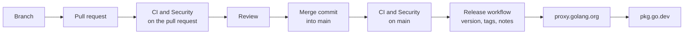

# Continuous integration and releases

## Flow



1. Every change is made on a branch (`feat/...`, `fix/...`).
2. A pull request to `main` is opened. Its commits and its **title follow
   Conventional Commits** (`feat: ...`, `fix(discovery): ...`): the commit
   subjects drive versioning and release notes.
3. `CI` and `Security` run on the pull request. Branch protection requires
   them before merging.
4. After review, the pull request is merged into `main` with a merge commit
   whose subject is `chore: merge pull request #N ...`, so the individual
   commits (one per file) reach `main` unchanged and the merge itself never
   bumps the version.
5. `CI` and `Security` run again on `main`.
6. When both succeeded for the merged commit, `Release` computes the next
   version, tags every module that changed and creates the GitHub release.
7. `Release` requests each new version from `proxy.golang.org`, which makes
   pkg.go.dev index it.

## Workflows

| Workflow         | Trigger                                        | Jobs                                                                                                                                                                                                                                                                                                                                                                                                                  |
|------------------|------------------------------------------------|-----------------------------------------------------------------------------------------------------------------------------------------------------------------------------------------------------------------------------------------------------------------------------------------------------------------------------------------------------------------------------------------------------------------------|
| `ci.yml`         | pull request to `main`, push to `main`, manual | PR title check; per-module `go mod tidy`, `go vet`, golangci-lint (errcheck, staticcheck, gosec, errorlint, bodyclose, noctx, contextcheck, misspell, gofmt, goimports, ...); unit tests with the race detector on Go 1.26 and 1.27; coverage gate (80% of library statements) with a report in the job summary; examples build; integration tests against Consul 1.20, 1.21, 1.22 and 2.0; fuzzing (30 s per target) |
| `security.yml`   | pull request, push to `main`, weekly, manual   | CodeQL (security-and-quality), govulncheck (SARIF report, gate on reachable vulnerabilities), gosec (SARIF report), gitleaks secret scanning of the full history, dependency review on pull requests (moderate severity, copyleft licences)                                                                                                                                                                           |
| `release.yml`    | completion of `CI` or `Security` on `main`     | gate on both workflows succeeding for the commit, versioning, tags, GitHub release, proxy and pkg.go.dev notification                                                                                                                                                                                                                                                                                                 |
| `dependabot.yml` | weekly                                         | Go modules of every module and GitHub Actions, with `chore:` commit messages                                                                                                                                                                                                                                                                                                                                          |

SARIF reports appear under **Security → Code scanning**.

## Versioning

The next version of each module is derived from the Conventional Commit
subjects since its last tag, **counting only commits that change Go files**
(`*.go`, `go.mod`, `go.sum`) of that module. Documentation, README, CI
workflows, linter settings and other non-Go files never trigger a release,
whatever their commit type; they are published with the next release that
does change Go code.

| Commits since the last tag                         | Bump                      | Example                          |
|----------------------------------------------------|---------------------------|----------------------------------|
| only `docs`, `style`, `chore`                      | none, no release          |                                  |
| `fix` or `refactor`                                | patch                     | v0.1.0 → v0.1.1                  |
| `feat`                                             | minor                     | v0.1.3 → v0.2.0                  |
| `!` after the type, or a `BREAKING CHANGE:` footer | major; **minor while v0** | v0.4.2 → v0.5.0, v1.4.2 → v2.0.0 |

Modules and tags:

| Module                         | Tag format                  | Paths considered                                                                       |
|--------------------------------|-----------------------------|----------------------------------------------------------------------------------------|
| `github.com/jhonsferg/consulx` | `vX.Y.Z`                    | `*.go`, `go.mod`, `go.sum` outside `contrib/`, `examples/`, `integration/`             |
| `.../contrib/prometheus`       | `contrib/prometheus/vX.Y.Z` | `*.go`, `go.mod`, `go.sum` under `contrib/prometheus/`                                 |
| `.../contrib/otel`             | `contrib/otel/vX.Y.Z`       | `*.go`, `go.mod`, `go.sum` under `contrib/otel/`                                       |
| `.../contrib/fiber`            | `contrib/fiber/vX.Y.Z`      | `*.go`, `go.mod`, `go.sum` under `contrib/fiber/`                                      |

`examples` and `integration` are never published.

The contrib modules require `github.com/jhonsferg/consulx v0.1.0` (the
first release) and keep a `replace ../../` directive for local development;
consumers ignore `replace`. When a contrib module needs a newer core
feature, raise its `require` in the same pull request.

### Release notes

Each release gets notes generated from the Conventional Commit subjects of
its module since the previous tag: an install command, a pkg.go.dev link,
sections for breaking changes, features, bug fixes, refactoring and
performance and documentation (with commit links), a count of maintenance
commits and a comparison link. Merge commits keep every commit, so the
notes list each change; if a pull request is squash-merged instead, its
title becomes the single entry, which GitHub links to the pull request. Contrib modules get their own
releases, never marked as latest.

Only the tip of `main` is released: if several merges land quickly, the
newest commit is released and includes the earlier changes.

## Repository settings (one-time, not stored in the repository)

1. **Branch protection** for `main` (Settings → Rules → Rulesets):
   - require a pull request before merging, with at least one approval;
   - require status checks: `Conventional PR title`, every `Lint (...)`,
     `Unit tests (Go 1.26)`, `Unit tests (Go 1.27)`, every
     `Integration (Consul ...)`, `Fuzz`, `CodeQL`, `govulncheck`, `gosec`,
     `Secret scanning (gitleaks)`, `Dependency review`;
   - require branches to be up to date; block force pushes and deletions.
2. **Merge settings** (Settings → General): allow merge commits (preferred:
   they preserve the per-file commits); squash merging also works, with the
   pull request title as the commit message.
3. **Actions permissions** (Settings → Actions → General): allow
   `github-actions[bot]` to create tags (workflow permissions "Read and
   write", or keep read-only and rely on the `contents: write` permission
   declared by `release.yml`).
4. **Code scanning** is enabled by the SARIF uploads; on private
   repositories it needs GitHub Advanced Security.
5. Enable **secret scanning** and **push protection** (Settings → Code
   security) in addition to gitleaks.

## Manual release

To release without waiting (for example the very first `v0.1.0`), run the
workflows manually from the Actions tab on `main`, or tag and push by hand:

```sh
git tag -a v0.1.0 -m "consulx v0.1.0" && git push origin v0.1.0
curl -fsS https://proxy.golang.org/github.com/jhonsferg/consulx/@v/v0.1.0.info
```
